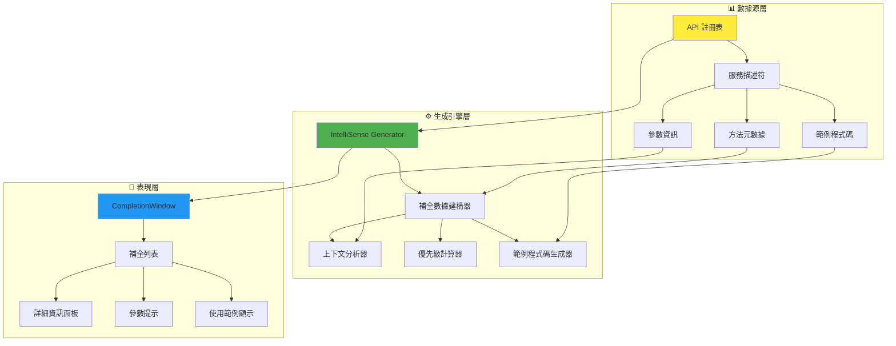
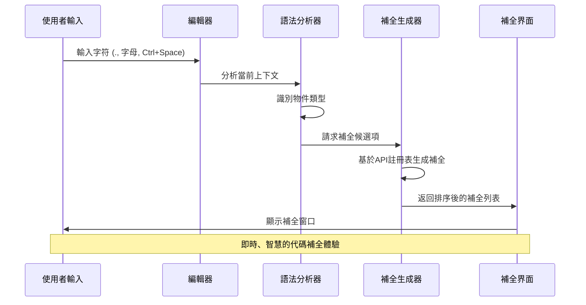
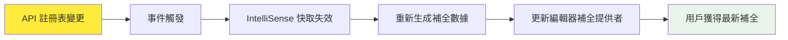

# IntelliSense 系統 - 智慧代碼補全指南

## 🧠 系統概述

本 WPF IronPython 應用程式採用**自動IntelliSense生成系統**，基於API註冊表自動生成智慧代碼補全，為Python腳本開發提供企業級IDE體驗。

### 🌟 核心特色

- **自動生成**：基於API元數據自動生成補全項目
- **即時更新**：API變更時自動更新IntelliSense
- **智慧過濾**：上下文感知的補全建議
- **豐富資訊**：方法簽名、參數提示、使用範例
- **多語言支援**：Python關鍵字 + C# API整合

## 🏗️ 系統架構

### IntelliSense 數據流架構



### 觸發機制流程



## 🔧 核心組件詳解

### 1. 自動補全數據生成器

```csharp
public class IntelliSenseGenerator
{
    private readonly IApiRegistry _apiRegistry;
    private readonly ConcurrentDictionary<string, List<ICompletionData>> _completionCache;
    
    public IntelliSenseGenerator(IApiRegistry apiRegistry)
    {
        _apiRegistry = apiRegistry;
        _completionCache = new ConcurrentDictionary<string, List<ICompletionData>>();
        
        // 監聽API變更事件
        _apiRegistry.ServiceRegistered += OnServiceRegistered;
        _apiRegistry.ServiceUnregistered += OnServiceUnregistered;
    }
    
    public List<ICompletionData> GenerateCompletionData()
    {
        var completionData = new List<ICompletionData>();
        
        foreach (var service in _apiRegistry.GetAllServices())
        {
            // 生成服務名稱補全
            completionData.Add(CreateServiceCompletion(service));
            
            // 生成方法補全
            foreach (var method in service.Methods)
            {
                completionData.Add(CreateMethodCompletion(service, method));
            }
            
            // 生成屬性補全
            foreach (var property in service.Properties)
            {
                completionData.Add(CreatePropertyCompletion(service, property));
            }
        }
        
        return completionData.OrderBy(x => x.Priority).ThenBy(x => x.Text).ToList();
    }
    
    private ICompletionData CreateMethodCompletion(
        ApiServiceDescriptor service, 
        ApiMethodDescriptor method)
    {
        return new ApiMethodCompletionData
        {
            Text = method.MethodName,
            Description = method.Description,
            Example = method.Example,
            Category = method.Category,
            ServiceName = service.ServiceName,
            Parameters = method.Parameters,
            ReturnType = method.ReturnType,
            IsAsync = method.IsAsync,
            IsDeprecated = method.IsDeprecated,
            Priority = CalculatePriority(method)
        };
    }
}
```

### 2. 智慧補全數據類型

```csharp
public class ApiMethodCompletionData : ICompletionData
{
    public string Text { get; set; }
    public string Description { get; set; }
    public string Example { get; set; }
    public string Category { get; set; }
    public string ServiceName { get; set; }
    public List<ApiParameterDescriptor> Parameters { get; set; }
    public Type ReturnType { get; set; }
    public bool IsAsync { get; set; }
    public bool IsDeprecated { get; set; }
    public double Priority { get; set; }
    public ImageSource Image { get; set; }
    
    public object Content => CreateRichContent();
    public object Description => CreateRichDescription();
    
    private StackPanel CreateRichContent()
    {
        var panel = new StackPanel { Orientation = Orientation.Horizontal };
        
        // 方法圖標
        panel.Children.Add(new Image 
        { 
            Source = GetMethodIcon(), 
            Width = 16, 
            Height = 16,
            Margin = new Thickness(0, 0, 5, 0)
        });
        
        // 方法名稱
        var methodName = new TextBlock 
        { 
            Text = Text,
            FontWeight = FontWeights.Bold
        };
        
        if (IsDeprecated)
        {
            methodName.TextDecorations = TextDecorations.Strikethrough;
            methodName.Foreground = Brushes.Gray;
        }
        
        panel.Children.Add(methodName);
        
        // 參數預覽
        if (Parameters?.Any() == true)
        {
            panel.Children.Add(new TextBlock
            {
                Text = $"({string.Join(", ", Parameters.Take(2).Select(p => p.Name))}...)",
                Foreground = Brushes.DarkGray,
                Margin = new Thickness(5, 0, 0, 0)
            });
        }
        
        return panel;
    }
    
    public void Complete(TextArea textArea, ISegment completionSegment, EventArgs e)
    {
        // 插入方法名稱
        textArea.Document.Replace(completionSegment, Text);
        
        // 如果有參數，顯示參數提示
        if (Parameters?.Any() == true)
        {
            var caretOffset = textArea.Caret.Offset;
            textArea.Document.Insert(caretOffset, "()");
            textArea.Caret.Offset = caretOffset + 1; // 游標置於括號內
            
            // 顯示參數提示窗口
            ShowParameterInsight(textArea);
        }
    }
    
    private void ShowParameterInsight(TextArea textArea)
    {
        var parameterInsight = new ParameterInsightWindow(Parameters, textArea);
        parameterInsight.Show();
    }
}
```

### 3. 上下文感知補全提供者

```csharp
public class ContextAwareCompletionProvider
{
    private readonly IntelliSenseGenerator _generator;
    private readonly PythonSyntaxAnalyzer _syntaxAnalyzer;
    
    public List<ICompletionData> GetCompletionsForContext(
        string text, 
        int offset,
        CompletionContext context)
    {
        var allCompletions = _generator.GenerateCompletionData();
        var currentContext = _syntaxAnalyzer.AnalyzeContext(text, offset);
        
        return FilterByContext(allCompletions, currentContext, context);
    }
    
    private List<ICompletionData> FilterByContext(
        List<ICompletionData> completions,
        SyntaxContext context,
        CompletionContext completionContext)
    {
        switch (context.Type)
        {
            case SyntaxContextType.ServiceAccess:
                // 用戶輸入了 "service_name."
                return FilterServiceMethods(completions, context.ServiceName);
                
            case SyntaxContextType.GlobalScope:
                // 全域範圍 - 顯示所有服務名稱
                return FilterGlobalCompletions(completions);
                
            case SyntaxContextType.MethodCall:
                // 方法調用中 - 顯示參數提示
                return FilterParameterCompletions(completions, context);
                
            default:
                return FilterPythonKeywords(completions);
        }
    }
    
    private List<ICompletionData> FilterServiceMethods(
        List<ICompletionData> completions, 
        string serviceName)
    {
        return completions
            .OfType<ApiMethodCompletionData>()
            .Where(c => c.ServiceName.Equals(serviceName, StringComparison.OrdinalIgnoreCase))
            .Cast<ICompletionData>()
            .ToList();
    }
}
```

## 🎯 補全類型詳解

### 1. 服務名稱補全

```python
# 用戶輸入: ho
# 補全建議:
host               # ScriptHost 服務
# host.log(message)  # 快速預覽
```

**特點**：
- 自動識別已註冊的服務
- 顯示服務描述和版本資訊
- 提供常用方法預覽

### 2. 方法名稱補全

```python
# 用戶輸入: host.
# 補全建議:
log(message)                    # 記錄日誌訊息
active_doc                      # 取得活動文件
get_config(key, default_value)  # 取得配置值
```

**特點**：
- 顯示完整方法簽名
- 包含參數名稱和類型提示
- 標示異步方法和過時方法

### 3. 參數提示補全

```python
# 用戶輸入: fs.write_text_file(
# 參數提示顯示:
write_text_file(
    filePath: str,          # 檔案路徑
    content: str,           # 檔案內容  
    append: bool = False    # 是否附加模式
)
```

**特點**：
- 即時參數提示
- 參數類型和預設值顯示
- 參數描述和範例

### 4. 智慧屬性補全

```python
# 用戶輸入: host.active_doc.
# 補全建議:
page_count          # int - 文件頁數
file_path          # str - 檔案路徑
is_dirty           # bool - 是否已修改
save()             # 儲存文件
```

## 🔄 自動更新機制

### API變更監聽系統



```csharp
public class IntelliSenseManager
{
    private readonly IApiRegistry _apiRegistry;
    private readonly TextEditor _editor;
    private IntelliSenseProvider _provider;
    
    public IntelliSenseManager(IApiRegistry apiRegistry, TextEditor editor)
    {
        _apiRegistry = apiRegistry;
        _editor = editor;
        
        InitializeIntelliSense();
        SubscribeToApiChanges();
    }
    
    private void SubscribeToApiChanges()
    {
        _apiRegistry.ServiceRegistered += async (sender, service) =>
        {
            await RefreshIntelliSenseAsync();
        };
        
        _apiRegistry.ServiceUnregistered += async (sender, serviceName) =>
        {
            await RefreshIntelliSenseAsync();
        };
    }
    
    private async Task RefreshIntelliSenseAsync()
    {
        await Task.Run(() =>
        {
            // 重新生成補全數據
            var newCompletionData = _generator.GenerateCompletionData();
            
            // 在UI執行緒上更新
            Application.Current.Dispatcher.Invoke(() =>
            {
                _provider.UpdateCompletionData(newCompletionData);
            });
        });
    }
}
```

## 🎨 自訂補全外觀

### 1. 圖標系統

```csharp
public class CompletionIconProvider
{
    private static readonly Dictionary<string, ImageSource> _iconCache = new();
    
    public static ImageSource GetIconForCompletion(ICompletionData completion)
    {
        return completion switch
        {
            ApiMethodCompletionData method => GetMethodIcon(method),
            ApiPropertyCompletionData property => GetPropertyIcon(property),
            ApiServiceCompletionData service => GetServiceIcon(service),
            PythonKeywordCompletionData keyword => GetKeywordIcon(),
            _ => GetDefaultIcon()
        };
    }
    
    private static ImageSource GetMethodIcon(ApiMethodCompletionData method)
    {
        var iconKey = method.IsAsync ? "AsyncMethod" : 
                     method.IsDeprecated ? "DeprecatedMethod" : 
                     "Method";
        
        return _iconCache.GetOrAdd(iconKey, key => LoadIcon($"Icons/{key}.png"));
    }
}
```

### 2. 語法高亮整合

```csharp
public class IntelliSenseAwareHighlighter : IHighlightingDefinition
{
    private readonly IApiRegistry _apiRegistry;
    
    public HighlightingRuleSet GetRuleSet(string name)
    {
        var ruleSet = _baseRuleSet.Clone();
        
        // 動態添加API服務名稱高亮
        foreach (var service in _apiRegistry.GetAllServices())
        {
            var rule = new HighlightingRule
            {
                Regex = new Regex($@"\b{Regex.Escape(service.PythonName)}\b"),
                Color = new HighlightingColor
                {
                    Foreground = new SimpleHighlightingBrush(Colors.Blue),
                    FontWeight = FontWeights.Bold
                }
            };
            ruleSet.Rules.Add(rule);
        }
        
        return ruleSet;
    }
}
```

## 📊 性能優化策略

### 1. 快取機制

```csharp
public class IntelliSenseCache
{
    private readonly ConcurrentDictionary<string, CachedCompletionData> _cache = new();
    private readonly Timer _cleanupTimer;
    
    public List<ICompletionData> GetCachedCompletions(string context, int offset)
    {
        var cacheKey = $"{context}:{offset}";
        
        if (_cache.TryGetValue(cacheKey, out var cached) && 
            !cached.IsExpired)
        {
            return cached.CompletionData;
        }
        
        return null; // 需要重新生成
    }
    
    public void CacheCompletions(
        string context, 
        int offset, 
        List<ICompletionData> completions)
    {
        var cacheKey = $"{context}:{offset}";
        var cached = new CachedCompletionData
        {
            CompletionData = completions,
            CreatedAt = DateTime.UtcNow,
            ExpiresAt = DateTime.UtcNow.AddMinutes(5)
        };
        
        _cache.AddOrUpdate(cacheKey, cached, (key, existing) => cached);
    }
}
```

### 2. 異步補全生成

```csharp
public class AsyncCompletionProvider
{
    public async Task<List<ICompletionData>> GetCompletionsAsync(
        string text, 
        int offset,
        CancellationToken cancellationToken = default)
    {
        // 快速返回快取結果
        var cached = _cache.GetCachedCompletions(text, offset);
        if (cached != null)
        {
            return cached;
        }
        
        // 異步生成新的補全數據
        return await Task.Run(() =>
        {
            cancellationToken.ThrowIfCancellationRequested();
            
            var completions = _generator.GenerateCompletionData();
            var filtered = _contextProvider.FilterByContext(completions, text, offset);
            
            _cache.CacheCompletions(text, offset, filtered);
            return filtered;
            
        }, cancellationToken);
    }
}
```

## 🛠️ 故障排除

### 常見問題解決

#### 1. IntelliSense 不顯示
```csharp
// 檢查API註冊狀態
var services = _apiRegistry.GetAllServices();
if (!services.Any())
{
    LoggingService.Instance.LogWarning("沒有註冊的API服務");
    // 重新初始化API註冊
    await _apiRegistry.DiscoverAndRegisterServicesAsync();
}
```

#### 2. 補全數據過時
```csharp
// 手動刷新IntelliSense
public void RefreshIntelliSense()
{
    _cache.Clear();
    _generator.InvalidateCache();
    var newData = _generator.GenerateCompletionData();
    _provider.UpdateCompletionData(newData);
}
```

#### 3. 性能問題
```csharp
// 監控補全生成時間
public async Task<List<ICompletionData>> GetCompletionsWithMonitoring(
    string text, int offset)
{
    var stopwatch = Stopwatch.StartNew();
    
    try
    {
        var result = await GetCompletionsAsync(text, offset);
        return result;
    }
    finally
    {
        stopwatch.Stop();
        if (stopwatch.ElapsedMilliseconds > 100)
        {
            LoggingService.Instance.LogWarning(
                $"IntelliSense 生成耗時: {stopwatch.ElapsedMilliseconds}ms");
        }
    }
}
```

## 🎯 最佳實踐

### 1. API設計建議

```csharp
[ApiService("Example", "1.0", "範例服務")]
public class ExampleService
{
    [ApiMethod("獲取用戶資訊", "user_management", 
               Example = "user = example.get_user_info('john_doe')")]
    public UserInfo GetUserInfo(
        [ApiParameter("用戶名稱", Example = "john_doe")] string username)
    {
        // 實現...
    }
}
```

**要點**：
- 提供清晰的描述和範例
- 使用一致的命名規範
- 標示參數的必要性和預設值

### 2. IntelliSense 最佳化

```csharp
// 為頻繁使用的API設定更高優先級
[ApiMethod("記錄日誌", Priority = ApiPriority.High)]
public void Log(string message) { }

// 為實驗性API添加警告
[ApiMethod("實驗性功能", IsExperimental = true)]
public void ExperimentalFeature() { }
```

### 3. 用戶體驗優化

- **即時反饋**：補全應在100ms內顯示
- **相關性排序**：最常用的API排在前面
- **豐富資訊**：提供完整的方法簽名和範例
- **錯誤提示**：對過時或錯誤的API給予警告

## 📈 未來發展

### 計劃功能

1. **AI驅動補全**：基於使用模式的智慧建議
2. **多語言支援**：擴展到其他動態語言
3. **實時協作**：多用戶協作編輯支援
4. **語義分析**：更深層的代碼理解和建議

---

## 📚 總結

本IntelliSense系統通過自動化生成和智慧過濾，為WPF IronPython應用程式提供了專業級的代碼補全體驗。系統的自適應性確保了隨著API的擴展，開發者始終能獲得最新、最相關的代碼補全建議。 