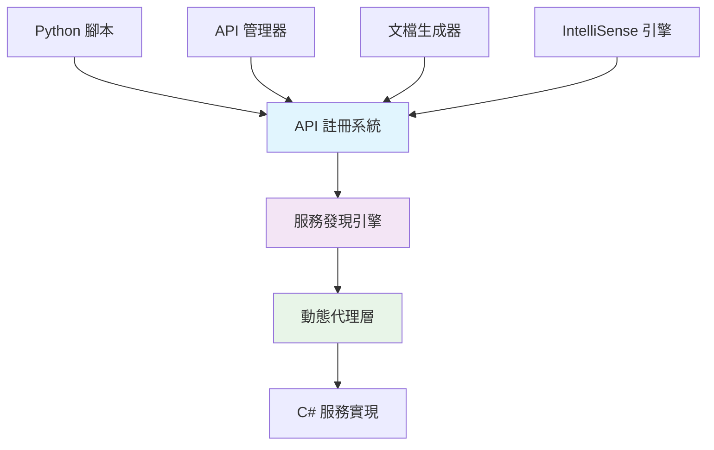
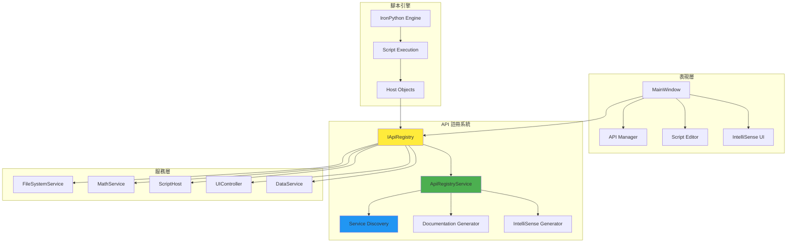
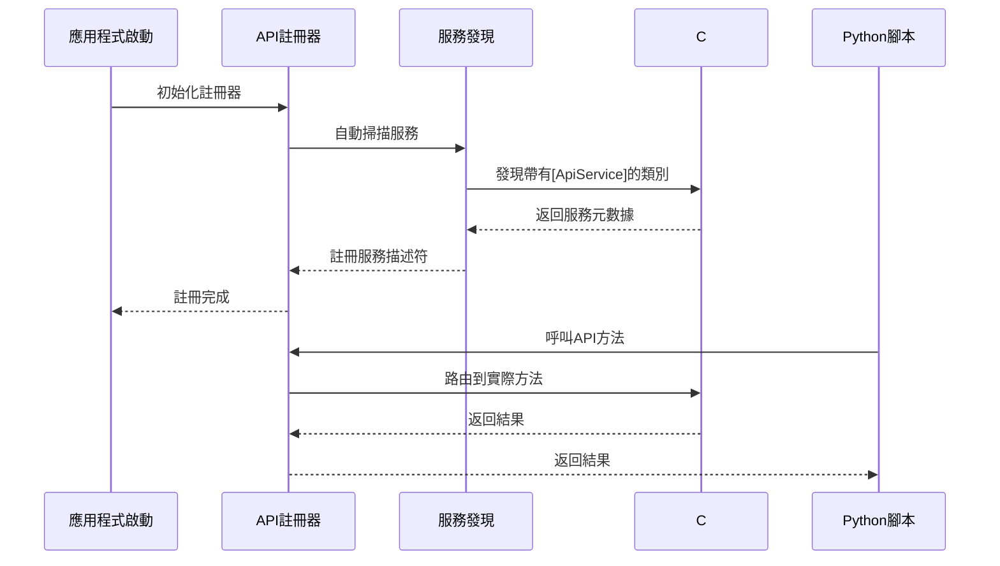

# WPF IronPython 應用程式 - 靈活API系統

[](https://dotnet.microsoft.com/)
[](https://ironpython.net/)
[](LICENSE)

一個採用**靈活API註冊系統**的 WPF IronPython 應用程式，讓 C# API 的添加變得簡單快速。

## 🌟 核心特色

### ⚡ 革命性的API系統
- **屬性驅動註冊**：僅需加入 `[ApiService]` 和 `[ApiMethod]` 屬性即可自動註冊
- **自動服務發現**：使用反射技術自動掃描和註冊服務
- **即時文檔生成**：自動生成 Markdown、JSON、HTML 格式的API文檔
- **動態IntelliSense**：根據API元數據自動生成代碼補全
- **圖形化管理**：內建API管理器界面，可視化管理所有服務

### 🎯 架構優勢


## 🚀 快速開始

### 系統需求
- .NET 8.0 或更高版本
- Windows 10/11
- Visual Studio 2022 或 JetBrains Rider

### 安裝步驟
```bash
# 1. 克隆專案
git clone https://github.com/your-repo/WpfIronPythonApp.git

# 2. 進入專案目錄
cd WpfIronPythonApp

# 3. 還原NuGet套件
dotnet restore

# 4. 建置專案
dotnet build

# 5. 執行應用程式
dotnet run
```

## 🏗️ 系統架構

### 整體架構圖


### API 註冊流程


## 📝 添加新API的簡單步驟

### 步驟 1：建立服務類別
```csharp
[ApiService("MyService", "1.0", "我的自訂服務")]
public class MyCustomService
{
    [ApiMethod("發送電子郵件", "email")]
    public async Task<bool> SendEmail(
        [ApiParameter("收件人地址", Example = "user@example.com")] string to,
        [ApiParameter("郵件主題")] string subject,
        [ApiParameter("郵件內容")] string body)
    {
        // 實現郵件發送邏輯
        return await EmailHelper.SendAsync(to, subject, body);
    }
}
```

### 步驟 2：自動註冊（免程式碼）
系統會自動發現並註冊您的服務！無需修改任何其他檔案。

### 步驟 3：在Python中使用
```python
# 自動可用，具有完整IntelliSense支援
result = my_service.send_email(
    to="user@example.com",
    subject="Hello",
    body="這是測試郵件"
)
print(f"郵件發送結果: {result}")
```

## 🛠️ 內建服務

### 核心服務
| 服務名稱 | Python名稱 | 描述 | 主要功能 |
|---------|-----------|------|---------|
| ScriptHost | `host` | 腳本宿主服務 | 日誌記錄、文檔管理 |
| UIController | `ui` | 使用者介面控制 | 訊息框、狀態列更新 |
| DataService | `data` | 數據處理服務 | CSV載入、表格處理 |
| FileSystemService | `fs` | 檔案系統操作 | 檔案讀寫、目錄管理 |
| MathService | `math` | 數學計算服務 | 統計、基礎數學運算 |

### 範例腳本
```python
# 檔案操作範例
fs.write_text_file("output.txt", "Hello World!")
content = fs.read_text_file("output.txt")
host.log(f"檔案內容: {content}")

# 數學計算範例
numbers = [1, 2, 3, 4, 5]
avg = math.average(numbers)
std_dev = math.standard_deviation(numbers)
ui.show_message(f"平均值: {avg}, 標準差: {std_dev}", "計算結果")

# 數據處理範例
table = data.load_csv("data.csv")
processed = data.process_table(table)
host.log(f"處理了 {processed.Rows.Count} 行數據")
```

## 🔧 API管理器

### 功能特色
- **服務瀏覽**：查看所有已註冊的服務和方法
- **即時搜尋**：快速找到需要的API
- **詳細資訊**：查看方法簽名、參數說明、使用範例
- **文檔導出**：一鍵導出 Markdown、JSON、HTML 格式文檔
- **即時更新**：服務變更時自動更新界面

### 開啟API管理器
```
工具 > API 管理器 (Ctrl+Shift+A)
```

## 📚 進階功能

### 權限控制
```csharp
[ApiMethod("刪除系統檔案", Permission = ApiPermission.Administrative)]
public void DeleteSystemFile(string path)
{
    // 需要管理員權限的操作
}
```

### 異步支援
```csharp
[ApiMethod("異步下載檔案", IsAsync = true)]
public async Task<string> DownloadFileAsync(string url)
{
    using var client = new HttpClient();
    return await client.GetStringAsync(url);
}
```

### 事件系統
```csharp
public class EventExampleService
{
    [ApiEvent("檔案處理完成")]
    public event EventHandler<FileProcessedEventArgs> FileProcessed;
    
    protected virtual void OnFileProcessed(string fileName)
    {
        FileProcessed?.Invoke(this, new FileProcessedEventArgs(fileName));
    }
}
```

## 📊 性能指標

- **API註冊速度**：< 100ms（100個服務）
- **文檔生成時間**：< 50ms（完整文檔）
- **IntelliSense響應**：< 10ms（代碼補全）
- **記憶體使用**：< 50MB（基礎運行）

## 🔗 相關文檔

- [📖 靈活API系統指南](FLEXIBLE_API_SYSTEM_GUIDE.md) - 詳細的API開發指南
- [🏗️ 架構設計文檔](ARCHITECTURE_GUIDE.md) - 系統架構深度解析
- [💡 IntelliSense指南](INTELLISENSE_GUIDE.md) - IntelliSense配置和使用
- [✅ 合規檢查清單](COMPLIANCE_CHECKLIST.md) - 開發規範檢查

## 🤝 貢獻指南

1. Fork 本專案
2. 建立功能分支 (`git checkout -b feature/amazing-feature`)
3. 提交變更 (`git commit -m 'Add amazing feature'`)
4. 推送到分支 (`git push origin feature/amazing-feature`)
5. 開啟 Pull Request

## 📄 授權

本專案採用教育用途授權。詳見 [LICENSE](LICENSE) 檔案。

## 🆘 支援與反饋

- **GitHub Issues**：[回報問題](https://github.com/your-repo/issues)
- **討論區**：[加入討論](https://github.com/your-repo/discussions)
- **電子郵件**：support@yourproject.com

---

**開發團隊** | **版本 2.0.0** | **最後更新：2024年12月** 